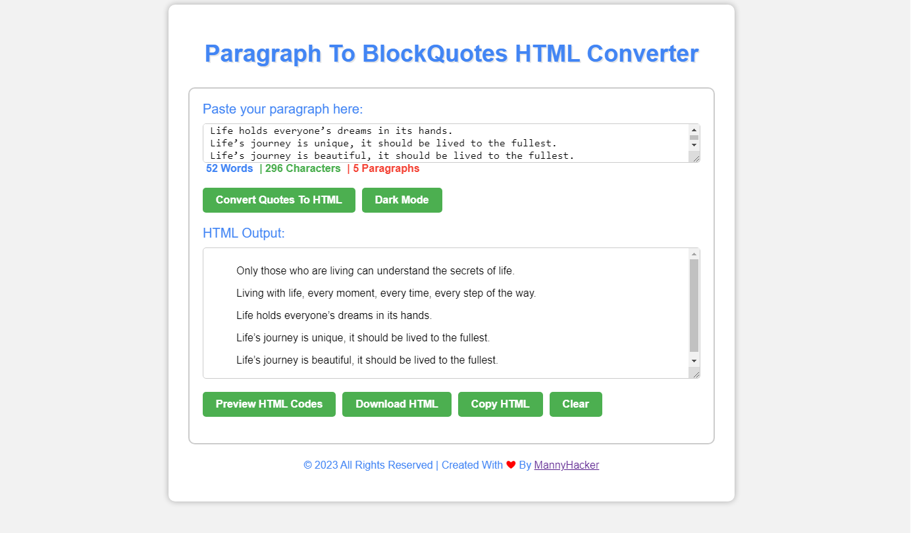
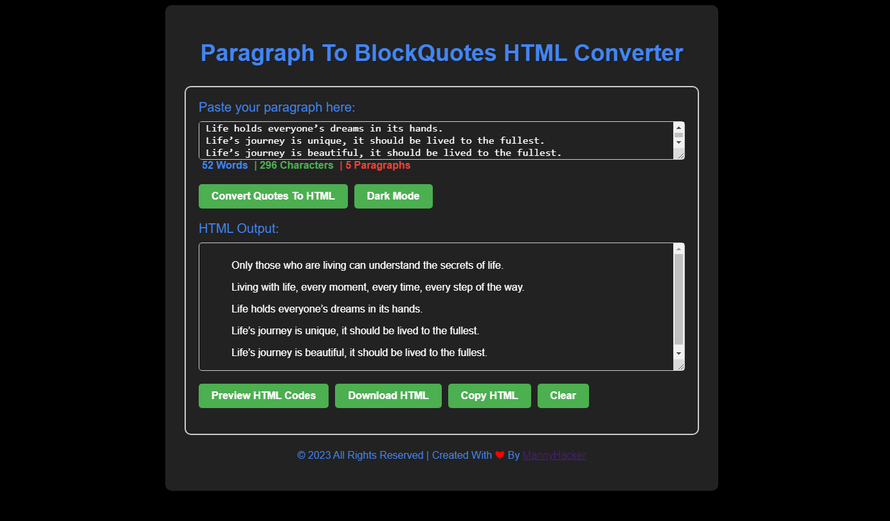

# Paragraph to Blockquotes HTML Converter

This is a simple web-based tool that allows you to convert a paragraph to blockquotes HTML code. You can use this tool to quickly convert a paragraph to HTML code that you can use on your website or blog.

## Features

- Convert a paragraph to blockquotes HTML code
- Preview the HTML output in a new window/tab
- Download the HTML output as a file
- Copy the HTML output to the clipboard
- Clear the HTML output from the output div
- Toggle dark mode for better readability
- Count the number of paragraphs, words, and characters in the input text
## Installation

You can install this tool by cloning the repository:

git clone https://github.com/MannyHackers/paragraph-to-blockquotes-html-converter.git

## Usage

1. Open `index.html` in your web browser.
2. Copy the paragraph that you want to convert to blockquotes HTML code.
3. Paste the paragraph into the input text area.
4. Click the "Convert to Blockquotes" button to convert the paragraph to blockquotes HTML code.
5. Use the other buttons to preview, download, copy, or clear the HTML output as needed.

## Validation

This script has validation for each button to ensure that the user enters a paragraph before performing any action. If the input is empty, it will show an error message and prevent the action from being executed.

## Screenshots

*Screenshot of the tool.*

*Dark Screenshot of the tool.*

## Contributing

Contributions are welcome! If you would like to contribute to this project, please fork the repository and submit a pull request.

## Issues

If you find any issues with this script, please report them [here](https://github.com/MannyHackers/paragraph-to-blockquotes-html-converter/issues).

## License

This project is licensed under the [MIT License](LICENSE).

## Credits

This script was created by [MannyHackers](https://github.com/MannyHackers)

## Support

If you need any assistance with this script, please contact [mstorrentdrive@gmail.com](mailto:mstorrentdrive@gmail).